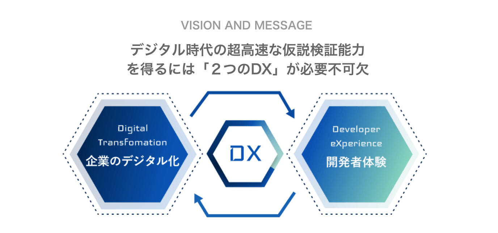
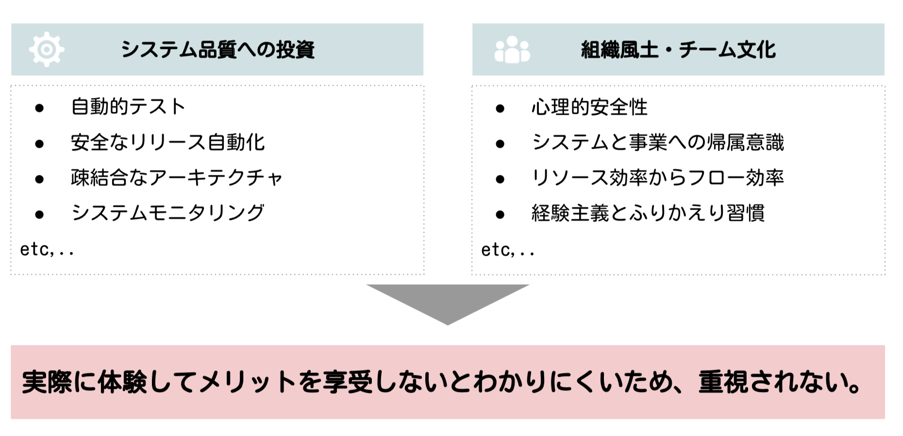
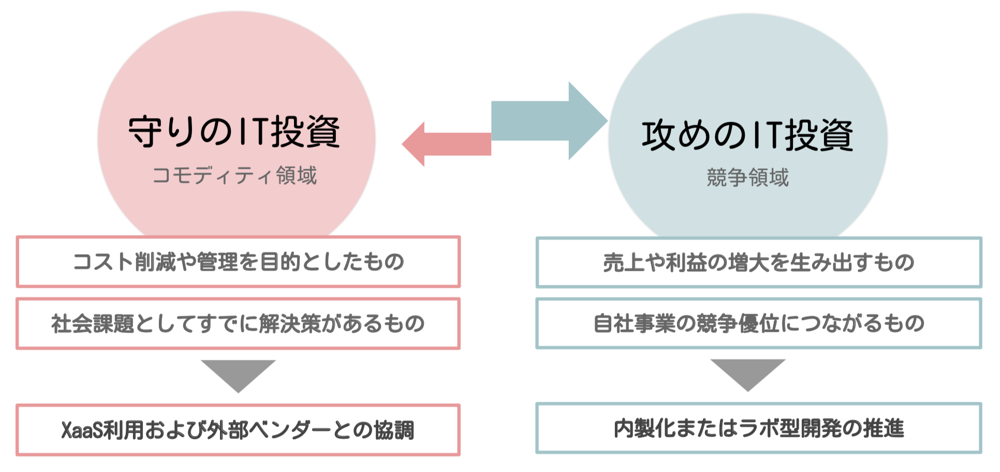
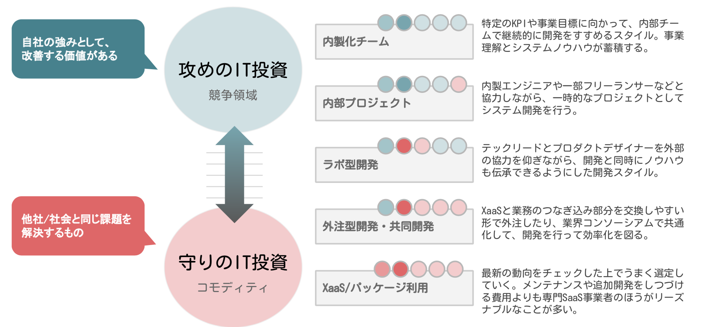
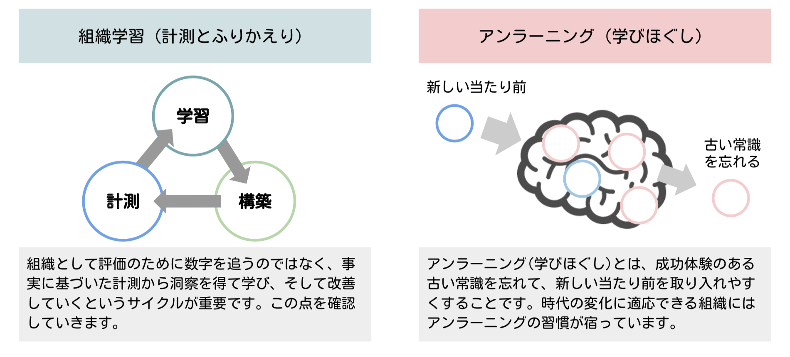
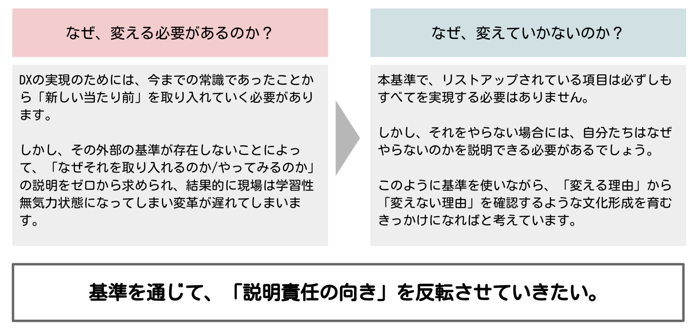

 「2つのDX」とデジタル時代の経営ガイドライン

## DX Criteria 
DX Criteria( DX基準 )は、日本CTO協会が監修・編纂している企業のデジタル化とソフトウェア活用のためのガイドラインです。

本基準は、デジタル技術を企業が活用するために必要な要素を多角的かつ具体的に体系化したものです。ソフトウェアエンジニアリング組織の健全な成長・経営目標の可視化・パートナーとのコミュニケーションなどに使っていただくことを目的に作成されています。

また、本基準は絶対ではありません。極めて実践的で具体的な項目で構成されているため、定期的に最新動向に併せてCTO協会の個人会員様と議論をおこないながら、適宜アップデートをしていくものです。

[説明資料](https://github.com/cto-a/dxcriteria/blob/master/asset/image/dxcriteria201912.pdf)

## DX Criteriaの理念 「2つのDX」

日本CTO協会では「DX」という言葉を２つの意味で捉えています。

1つは、企業がどれだけ経営に対してデジタル技術を用いたビジネス変革ができているかを表す企業のデジタル化(Digital Transformation)です。

もう1つは先端開発者にとっての働きやすい環境と高速な開発を実現するための文化・組織・システムが実現されているかを意味する開発者体験(Developer eXperience)です。

これらの2つは、経営にとってヒト・モノ・カネが一体であるように、一体で実現されるものです。デジタル技術は目に見えないため、しばしばわかりやすいものにだけ投資して見えない品質をおろそかにしてしまいます。そのため、開発者体験は悪化し、企業のデジタル化を阻害してしまうことがあるのです。

私たちは、「2つのDX」を一体で捉えた基準をつくり、その普及をしていきたいと考えています。

## DX Criteriaのポイント
DX Criteriaの目的は 「超高速な事業仮説の検証能力を得ること」です。

企業のデジタル化において、事業戦略の重要性は言うまでもありません。

しかし、本基準においては事業戦略そのものよりもむしろ、戦略を遂行するための高速な意思決定・高速なアプリケーションの開発・改善・測定・仮説構築などを実施する能力そのものを最重要視します。

なぜなら、現在のマーケットの不確実性の中で勝ち残る能力において最も重要なのは、「変化に適応」できるということだからです。

そのような目的のもと必要な組織習慣や能力について、段階的にアセスメントできるよう以下のポイントに注目して作成されています。

| 項目 | 説明 |
|:--|:--|
| 組織文化と「見えない」投資 | 高速な開発を行う組織には一度体験しないと価値がわかりにくい投資や習慣があります。この説明コストの高さを軽減し、導入を促します。 |
| タスク型ダイバーシティ | 事業価値あるサービスが実現するためには様々なデジタル人材と既存事業人材の相互理解と共創関係が必要で、この進展を促します。 |
| メリハリのあるIT戦略 | 標準化・コモディティ化した領域については外部サービスを利用し、競争領域に特化して内製化をすすめるためのメリハリのある投資を促します。 |
| 組織学習とアンラーニング | 新しいツールや潮流に挑戦するための組織学習と、時代が変わってしまった習慣のアンラーニング(学びほぐし）を促します。 |
| 自己診断と市場比較 | 関連するレポートと自己診断によって競合状況との差を認識しやすくし、自社の強み弱みを理解して段階的に変化できるように促します。 |

### ポイント１：組織文化と「見えない」投資
デジタル技術を経営に生かしていくためには、「ソフトウェアは見ることができないという性質(不可視性)」を理解し、その上で必要となる「品質への投資」を進めることが重要になります。また、それを育むための組織文化も重要なファクターになります。こちらも見えにくいものです。

たとえば、ソフトウェアのインテグレーションテストとデプロイパイプラインの自動化は、品質を担保するだけでなくリリースサイクルを早くする効果があります。そして、チームが細かなチェックを神経を削って確認することからいくぶんか開放します。エンジニアはソフトウェアを修正することへの恐怖や不安が減り、活発に改善活動が進みます。また、心理的安全性の担保されたチームは、闊達な意見交換が行われプロジェクトの課題にいち早く気がつけます。

しかし、これらの習慣は「力を入れて実行する合理性が説明しにくいこと」でもあります。ソフトウェアの不可視性を考慮に入れるとなおさらです。

このような「見えない」技術的な投資や組織文化に対して、ひとつひとつ実施していき役割が企業において必要になります。CTO(最高技術責任者)やVPoE(エンジニアリング担当VP)がそのような職責を担うことが多いのです。

これらの技術的な投資の価値や組織文化の価値は、実際に現場レベルでソフトウェアを書いてきた経験がないと理解しにくく、体感的な納得がしにくいものでもあります。

体感的に納得できていることを説明したり意思決定することは難しくありません。一方、体感的な納得がない状態では、説明をひどく難しく感じたり不必要なものを持って回った説明をしているように感じてしまいます。

これらの技術的な「見えない投資」とシステムを改善する組織の文化は、車輪の両輪のようなものです。２つのうち片方が欠けていても、事業の改善速度は悪化していく傾向があります。

いわゆる技術的負債やレガシーシステムとは「組織が必要な速度でソフトウェアの改善ができなくなること」によって発生します。

### ポイント２：タスク型ダイバーシティ 
デジタル技術をイノベーティブに活用するためには、特定の職能に閉じた組織のみでは成し遂げられません。多くの場合、デザイナーやエンジニアを始めとした複数の専門職が同じ目的のもとチームとして働くことによって、これらは成し遂げられます。

また、意思決定の速度を高速にするためには、自己完結であることが重要です。チームは「あるミッションの実行にあたって必要なケイパビリティ」のすべてを持っていることが重要になります。１つの仕事をするのに、様々な部署の調整が必要な状態になった組織は、実行の速度を失ってしまいます。

そのため、DX Criteriaでは組織的な職能関係がどのように融和・融合しているかを測ります。これは特定の職種だけの問題ではなく、ソフトウェア要件に関わる組織全体にとって重要な課題になります。

いわゆるダイバーシティ：多様性というと、女性活躍や人種宗教といった属性に伴う多様性を指すことが多く、これを「デモグラフィック型のダイバーシティ」といいます。その一方、複数の職能にまたがったチームが編成されている状態や組織を「タスク型ダイバーシティの高いチーム」といいます。

もちろんどちらの多様性も重要です。とりわけソフトウェア開発の現場においては、複数の職能に組織が分断されすぎていると、コミュニケーションコストが増大しやすく結果的に改善の速度が失われてしまう現象があります。

そのため、本基準では「タスク型のダイバーシティ」に注目します。

 

スタートアップにおいて、事業の立ち上がりのフェーズでは小さなチームに様々な専門家が集まっていきタスク型ダイバーシティの高いチームが
編成されます。この時点において、経営的意思決定とチームの意思決定は一致するため、高速でイノベーティブな事業開発が望めます。コミュニケーションも四六時中近くにいるメンバーとの対話になるため効率的です。

一方、事業が立ち上がり、徐々に競争環境が固定化されると「より効率よく」「より管理しやすく」部門が編成されるようになります。職能ごとの部門が編成され、組織ごとの経営指標を追いかけるようになります。

タスク型ダイバーシティの低いチームでは、より深く研究を進めたり効率的なリソース運用が望めるため、「知の深化」が進みます。

組織が大きくなるに連れ、徐々に組織同士のセクショナリズムが発生したり、全体最適な行動が取れなくなってきます。
組織がサイロ化され、イノベーティブな行動が組織から減ってきてしまいます。市場環境が不確実になりさまざまなイノベーションが連続するデジタル時代においては、このような状態を維持することは得策ではありません。

必要に応じて、戦略的に複数の職能をまたいだチームを編成し、機動力を高く維持する必要が出てきます。
これにともなって小さなチーム同士で同じようなことをしてしまったり、専門的な職能の人材の活用に関して、リソース効率的な無駄が生じやすくなります。

タスク型ダイバーシティの高いチームでは、意思決定の速さとイノベーティブなアクションが望めます。これを「知の探索」といいます。

この２つ、「知の探索」「知の深化」の両方を事業フェーズや組織戦略に応じて大胆に切り替えていくことが
不確実な次代の経営には必要な判断になってきます。

### ポイント３：メリハリのあるIT戦略 
標準化・コモディティ化した領域については外部サービスを利用し、競争領域に特化して内製化をすすめるためのメリハリのある投資を促します。 

DXの進んだ組織では、自社の利益増大やビジネスの変革につながるようなコアな機能に関してを集中して自社開発する傾向があります。
これを「攻めのIT領域」といいます。この領域では、ソフトウェアに対する知見が自社に残るように内製開発が望ましいです。また、自社に十分な人員がいない場合においても、パートナー企業とともに自社にソフトウェアの知見が残るようなラボ型開発のようなスタイルが必要になります。

よくある誤解としては、すべてのソフトウェアは内製開発すべきだというものがあります。たとえば、現実的に多くのIT企業ではOSレベルでの開発は行いませんし、インフラについてもクラウドベンダーのサービスを活用しています。このようにすでに「コモディティ」となったソフトウェアの構成要素は、自社で開発するのではなくうまく外部サービスを活用していくことが望ましいのです。この領域を「守りのIT領域」と言います。

現代は、SaaS型の事業が増えています。これらをうまく選定し活用しましょう。「守りのIT領域」をオーダーメイドで作る必要はありません。

オーダーメイドのソフトウェアは月額費用を払うだけでサービス提供会社が継続的に改善されるXaaS(IaaS/PaaS/SaaSなど)と異なり、常に自社で改善をコントロールしていく必要があります。そして、多くの場合必要な改善リソースを確保できなくなってしまいます。

サービス事業会社は、自社のビジネスとして複数の顧客のために事業改善を行いますが、守りの領域のシステムは自社開発ではコストとみなされてしまいます。継続的な改善の経済合理性がなくなるからです。そのため、長期的には改善速度が遅くなってしまいます。

つまり、誰かにとっての「攻めのIT領域」であるSaaS事業を守りとして活用することで効率よくIT活用できるのです。

また、このメリハリあるIT投資をするにしても、自社の競争領域とコモディティ領域を見極めることは非常に難しいものです。
そのためには、業界動向に対する洞察が重要になります。業界動向の把握の一助にDX CriteriaとCTO協会を活用ください。

「攻め」と「守り」は完全なゼロイチで決まるものではありません。また、戦略なく決まるものでもありません。

現実的な制約の中で、一定のグラデーションを持ちます。

たとえば、全く内製の開発人員がいなく採用を進めている最中であるなら、パートナーとともにノウハウを蓄積しながら開発する方法もあります。

たとえば、守りの領域にも関わらずSaaS化が進んでいないような領域でのシステム開発をする場合には、競合他社と手を組むなどできるかぎりクラウドサービスと連携しながらつくるといった手段もあります。

### ポイント4:組織学習とアンラーニング 
新しいツールや潮流に挑戦するための組織学習と、時代が変わってしまった習慣のアンラーニング(学びほぐし）を促します。

### ポイント5:自己診断と市場比較 
関連するレポートと自己診断によって競合状況との差を認識しやすくし、自社の強み弱みを理解して段階的に変化できるよう促します。 

