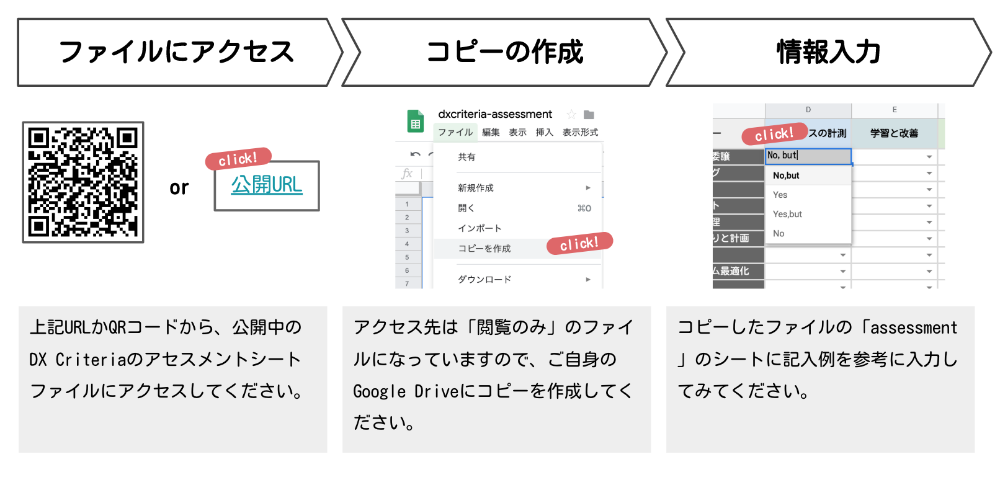
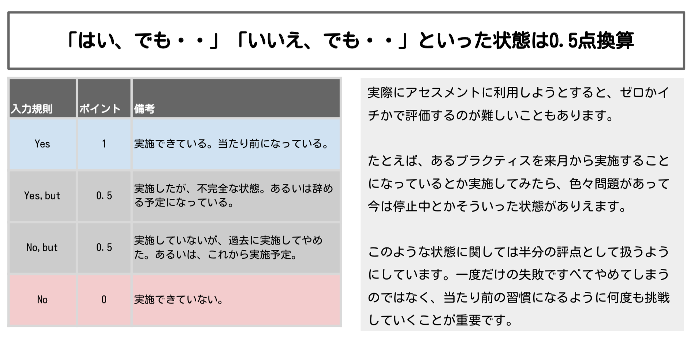

# DX Criteriaの使い方

## ３つの主な使い方
DX Criteriaのご利用に関して、主な使い方は次の３つです。

+ 自社のDX進捗度の簡易的なアセスメント
+ 担当マネージャによるチームとシステムごとの詳細なアセスメント
+ 外部パートナーとのコミュニケーション

たとえば、半期に一度などの定期的な自社によるアセスメントに活用できます。
自社の強み弱みを可視化し、戦略決定の議論などのご活用いただけます。

また、必要に応じ外部パートナー企業との間で「どのようにしたら高速な開発ができるのか」という論点での議論にも活用できます。
これによって、自社では足りない部分のサポートやサービス導入をするといった商談をすすめる上でも有効です。

巨大なエンタープライズシステムを分析することにも利用できます。チームごと・システムごとのようにテーマごとに分割した上で、複数の担当者に記入していただくなどすることで部門間の違いや共通の強み・弱みを知ることができます。

## アセスメントシートの使い方

[簡易アセスメントシート dxcriteria-assessment ](https://docs.google.com/spreadsheets/d/1Wnyz6vZVrVnkbteQsrJ7IROFaiFb6ocDLocG2KzzWJs/edit?usp=sharing)にアクセスし、シートをご自身・自社のGoogle Driveにコピーしてご利用ください。

## アセスメントシートの記入方法

### 各項目に対して回答は４種類

戦略上あえて取り入れていない場合や実施しようとしたけれども不完全といったように、YES/NOとはっきり言い切れない項目も
あるでしょう。このような場合のためにYES But / NO Butの回答が用意されています。これは中立的に0.5点として換算されます。

あまりにこのような項目が多い場合には、ベストプラクティスから離れてしまっていたり、習慣が定着しないなどの組織的問題がはらんでいる可能性があるため注意は必要です。

### シートへの記入

回答用シートに１つひとつ項目を確認しながら記入を行ってください。

### 評価結果の確認

### ご利用上の注意
活用に関して、以下の点にご注意ください。
